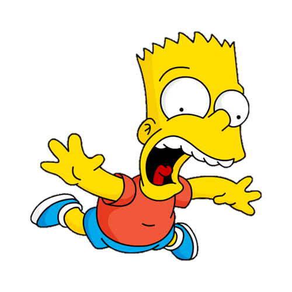
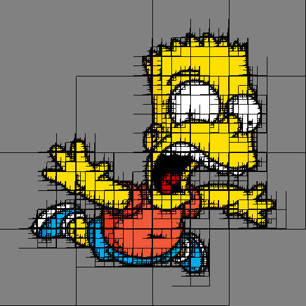

# QuadTree Image Compression

This project implements a QuadTree-based image compression and decompression algorithm for PNG images. It compresses a PNG image into a text file and then decompresses the text file back into a PNG image. The project uses the `lodepng` library for PNG image handling.

## Features
- Compress a PNG image into a `.txt` file using QuadTree decomposition.
- Decompress the `.txt` file back into a PNG image.
- Supports quadratic resolution images (e.g., 100x100, 500x500, 1000x1000, etc.).
- Customizable compression tolerance to balance between compression ratio and image quality.

## Requirements
- C++ compiler (e.g., g++, clang, or MSVC).
- `lodepng` library for PNG image handling.

## Dependencies
This project uses the `lodepng` library to load and save PNG images. You can find the library and its documentation here:
- [lodepng GitHub Repository](https://github.com/lvandeve/lodepng)
- [lodepng Documentation](https://raw.githubusercontent.com/lvandeve/lodepng/master/lodepng.h)

Make sure to include `lodepng.cpp` and `lodepng.h` in your project.

## Usage

### Compiling
To compile this project use the following command in a terminal:
```bash
g++ -o quadtree main.cpp QuadTree.cpp PNGImage.cpp lodepng.cpp -std=c++11 -O3 -Wall
```

### Compress an Image
To compress a PNG image into a `.txt` file, run the program with the following command:
```bash
./quadtree compress input.png compressed.txt
```

### Decompress an Image
To decompress a .txt file back into a PNG image, run the program with the following command:

```bash
./quadtree decompress compressed.txt output.png
```
### Example
Here is an example of compressing and decompressing an image:



Image above compressed to a .txt file: [Here](./images/bartCompressed.txt)

Decompressed .txt file:



## Limitations
- Only PNG images are accepted. 

- Quadratic Resolution Only: The program only works with images that have quadratic resolution (e.g., 100x100, 500x500, 1000x1000). Non-quadratic images will not be processed correctly.

- Lossy Compression: The compression is lossy, meaning some image quality may be lost depending on the tolerance level used.

## How It Works
The QuadTree algorithm divides the image into four quadrants recursively. If a quadrant is uniform (or nearly uniform, based on a tolerance threshold), it is stored as a single color. Otherwise, the quadrant is further divided. This process continues until the entire image is compressed.


## Customization
You can adjust the compression tolerance to control the balance between compression ratio and image quality. A higher tolerance will result in better compression but may reduce image quality.

## Contributing
Contributions are welcome! If you find any issues or have suggestions for improvements, please open an issue or submit a pull request.